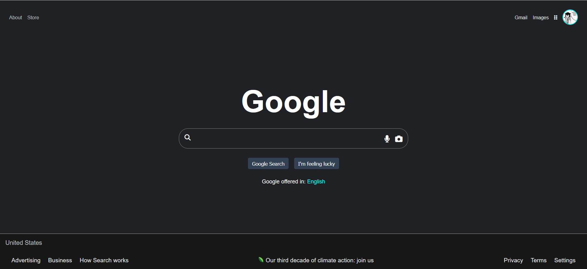

# Project Title: Google Homepage Replication

## Description
This Project tries to replicate the Google homepage. The primary goal is to learn how to structure and styling principles behind building a webpage.

## Features
- Reproduction of the Google homepage layout.
- Application of basic CSS for styling and positioning elements.
- Responsiveness for various screen sizes.

## Learning Objectives
- Gain hands-on experience in HTML and CSS development.
- Understand the use of Flexbox techniques.
- Practice implementing responsive design principles.

### Built With
- HTML
- CSS

- ## Development Process
I followed a step-by-step tutorial on YouTube that created a Google homepage replica. The process involved breaking down the layout, styling each component, and ensuring responsiveness across different devices.

## Challenges Faced
- Understanding and replicating the exact layout of Google's homepage.
- Making the page responsive and compatible across different screen sizes.

## Screenshot

## Acknowledgments
Thank you to the creator of the tutorial (Smoljames) for providing this learning resource on [YouTube](https://www.youtube.com/watch?v=70T2GMDKl6M)
